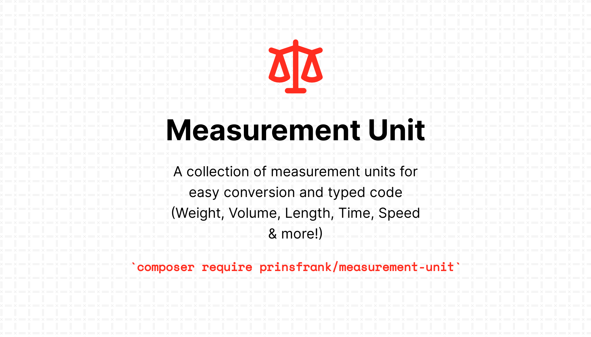

<picture>
  <source srcset="docs/images/banner_dark.png" media="(prefers-color-scheme: dark)">
  
</picture>

# Measurement-unit


[](https://codecov.io/gh/PrinsFrank/measurement-unit)

## Installation

To use this package in your project, run the following command:

```shell
composer require prinsfrank/measurement-unit
```

## Provided units

| Type        | Available unit                                                                                     |
|-------------|----------------------------------------------------------------------------------------------------|
| Length      | Fathom, Foot, Furlong, HorseLength, Inch, Meter, NauticalMile, StatuteMile, SurveyMile, Thou, Yard |
| Speed       | KilometerPerHour, MeterPerSecond, MilesPerHour                                                     |
| Temperature | Celsius, Fahrenheit, Kelvin, Rankine                                                               |
| Time        | Day, Hour, Minute, Second                                                                          |
| Torque      | NewtonMeter                                                                                        |
| Volume      | CubicInch, CubicMeter, CubicYard, FluidDram, FluidOunce, Liter, Pint, Quart, TableSpoon            |
| Weight      | Kilogram, MetricTon, Pound                                                                         |

All the units of a type can be converted to each other with corresponding methods.
